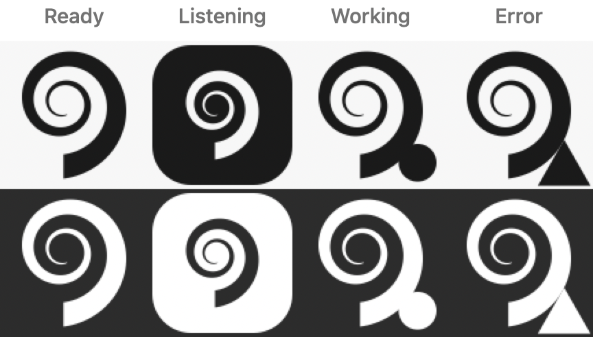

<div align="center">


**Dictation that learns how _you_ talk. On your Mac, and nowhere else.**

[Install](#install) · [Why](#why-this-exists) · [How it works](#how-it-works) · [Privacy](docs/PRIVACY.md) · [Roadmap](#roadmap) · [Contributing](CONTRIBUTING.md)

[](https://github.com/lexian24/cochlea/actions/workflows/ci.yml)
[](LICENSE)
[](#try-what-exists)
[](macos/README.md)

</div>

---

> ### ⚠️ Early. It dictates and it adapts; it does not train yet.
>
> **You can dictate with this.** Press the shortcut, speak, and the words
> appear at your cursor — in TextEdit, a browser, VS Code — at 383–441 ms
> warm on an M2. The hotkey, the microphone, the voice detection, device
> switching mid-session and typing at the cursor have all been exercised by
> hand, and six defects that only a person could find were fixed doing it
> ([macos/TESTING.md](macos/TESTING.md)).
>
> **It already adapts; it does not train yet.** Fix a misheard word once and
> it stops being misheard — the correction repairs your text, files the pair,
> and adds the word the recogniser did not know, in force on the next
> sentence. No training is involved, because biasing needs none. Import your
> own writing and the same thing happens in bulk. A revision filter decides
> which edits are mishearings and which are you changing your mind, so only
> the first kind teaches anything.
>
> What is missing is the model that learns your accent and phrasing from those
> pairs. The evaluation harness that will gate it is built and tested; the
> trainer is not.
>
> **Not shipped.** No signed build, so a release you did not compile yourself
> would be refused by Gatekeeper. Build it from source, or wait.

## Install

```sh
brew tap lexian24/cochlea https://github.com/lexian24/cochlea
brew install cochlea
```

That installs the `dictate` CLI — the adaptation engine, importers, evaluation
harness, and the ASR helper the app talks to. Speech recognition needs the
`asr` extra, which is Apple Silicon only:

```sh
pip install 'cochlea[asr]'      # mlx-whisper
dictate asr-check my.wav --model ~/.cochlea/models/whisper-small
```

The menu bar app is **not** packaged yet: it needs signing and notarization
(F22) before `brew install --cask` would be honest — Gatekeeper blocks an
unsigned download, and it is strictest with exactly the two permissions
cochlea needs. Build it from source in the meantime, which works today
because a locally compiled app is not quarantined:

```sh
Tools/setup-testing.sh          # builds, signs ad-hoc, unquarantines
./build/cochlea.app/Contents/MacOS/cochlea
```

[`macos/BUILDING.md`](macos/BUILDING.md) has the details.

<details>
<summary>Other ways</summary>

```sh
# from source
git clone https://github.com/lexian24/cochlea && cd cochlea
pip install -e ".[dev,zh,acoustic,asr]"
```

Installing a formula straight from a URL no longer works — Homebrew requires
formulae to live in a tap, and rejects both a URL and a local path. The tap
above is the supported route.

`brew install --cask cochlea` will install the menu bar app once there is one.
[`Casks/cochlea.rb`](Casks/cochlea.rb) records what that needs. See
[docs/RELEASING.md](docs/RELEASING.md).

</details>

## Why this exists

Off-the-shelf dictation is trained on everyone, so it is mediocre for anyone in
particular. It mangles your colleagues' names, your project's jargon, the
libraries you use daily, and — if you speak more than one language — most of
what you actually say.

The usual fix is to send your voice to a server that learns from millions of
people. cochlea does the opposite: it learns from one person, on that person's
machine, from corrections they explicitly make.

## How it works

Three adaptation layers, each cheaper and faster than the one below it:

| Layer | Learns from | Updates | Needs audio? |
|-------|-------------|---------|--------------|
| **Lexicon + biasing** | imported text, corrections | instantly | no |
| **Post-correction LM** | `(what ASR heard, what you meant)` pairs | nightly | no |
| **Acoustic adapter** | your voice | monthly, opt-in | yes |

The top two layers need **only text**. If you never let cochlea keep audio, you
still get most of the benefit — a supported configuration, not a degraded one.

```
             ┌──────────────── lexicon ◀────────────┐
             ▼                                      │  instantly
audio → VAD → ASR (frozen) → biasing → your cursor  │
                                       │            │
                            fix-last ──┴────────────┤
                                       │            │
                            attribution filter ─────┘
                                       ▼
                              correction store ─────▶ post-correction LM
                              the durable asset        (nightly, not built)
```

The upper loop closes today and needs no training: fix a misheard word once,
it enters the lexicon, and the next sentence gets it right. The lower one —
learning your accent and phrasing from those pairs — is what still needs a
trainer.

Corrections are captured **only when you explicitly make them**. cochlea does
not watch your text fields. Reading arbitrary app windows through the
Accessibility API would be fragile and would contradict the whole point — and
the cost of that choice is real: cochlea captures far fewer corrections than a
design that watched your editor, so it learns more slowly. That trade is the
point.

<div align="center">

<br>
<sub>The icon inverts for exactly as long as the microphone is open.</sub>
</div>

## Privacy, concretely

- Nothing leaves your machine. There is no server to send it to.
- **Audio retention is off by default.** When enabled, cochlea stores
  log-mel spectrograms, not listenable audio; raw audio needs a separate opt-in.
- Stored features are AES-GCM encrypted, capped by both age and hours, and
  excluded from backup.
- Importers read **only your own** messages and commits, and filter before
  anything touches disk — not after.
- No permission is requested until you invoke the feature that needs it.
- `dictate purge` deletes everything, including the key.

The [invariants](docs/SPEC.md#6-invariants) list what the code may not do
regardless of what any test says. Two are enforced by CI.

Every claim above is meant to be checkable from outside the project.
[**docs/PRIVACY.md**](docs/PRIVACY.md) says how — where each file lives, what
is in it, and the commands to look for yourself.

## Try what exists

```sh
git clone https://github.com/lexian24/cochlea && cd cochlea
pip install -e ".[dev,zh,acoustic]"
pytest -q                      # 232 tests
```

Seed a lexicon from your own writing — the first step of the journey, and it
works today. Import proposes; nothing is written until you say so:

```console
$ dictate import text ~/chat-export.txt --author "Your Name"
imported 412 samples from text:~/chat-export.txt
  3 terms, 2 phrases
    + term   kubectl                      x27
    + term   nginx                        x19
    + phrase eval gate                    x14
    + phrase kubectl apply                x11
  orthography variant (F6): 'la' x14 vs 'lah' x9
    -- run `dictate lexicon canonicalize la lah` to pick one

Nothing was written. Re-run with --commit to keep this.
```

A chat export is a conversation, and half of it belongs to someone else, so
`--author` is not optional: with two speakers and no author, the import
refuses rather than guessing. `dictate import gitlog . --author you@example.com`
does the same from your commit history, filtered by git itself.

Then the recogniser is biased towards it — phrases in context, not just words:

```console
$ dictate asr-check sample.wav --model ~/.cochlea/models/whisper-small
text               Deploy the service with kubectl and check the gink's logs.

$ dictate asr-check sample.wav --model ~/.cochlea/models/whisper-small --lexicon
lexicon            5 entries
biased terms hit   kubectl, nginx
text               Deploy the service with kubectl and check the nginx logs.
```

That costs about 10 ms. `dictate lexicon` shows what is in there, what it is
worth in logits, and how often each entry has actually won.

The evaluation harness works too — it gates every future training run, so it
had to exist first:

```sh
dictate holdout                  # reserve a share, permanently, from training
dictate eval                     # holdout metrics and the gate decision
dictate adapters                 # versions, and which one is promoted
dictate rollback --layer postcorr
dictate doctor                   # paste this into a bug report
```

## Repository layout

| Path | What it is | Verified? |
|---|---|---|
| `src/cochlea/` | Adaptation engine: store, attribution, phonetics, importers, lexicon, biasing, eval, training, retention, profiles | yes — 232 tests |
| `macos/` | M0 dictation app (Swift) | 66 Swift tests in CI; hand-tested through T1–T7 |
| `Formula/`, `Casks/` | Homebrew formula (works) and cask (template) | formula verified end to end |
| `Resources/logo/` | Brand marks, generated by `Tools/make_logo.py` | — |
| `docs/SPEC.md` | The engineering spec and handoff | — |
| `docs/DECISIONS.md` | Decision records, with the reasoning kept | — |
| `docs/STAGE2-IPHONE.md` | iPhone design: one-way sync, no mic, no model | designed, not built |

## Roadmap

| | Milestone | State |
|---|---|---|
| **M0** | Competitive dictation, zero learning | ASR, hotkey, mic and injector all verified by hand (T1–T7); streaming and latch activation unproven (T9–T10) |
| **M1** | Correction capture | fix-last panel, store, and corrections feeding the lexicon (D11–D13); review queue still CLI-only |
| **M2** | Lexicon and biasing | **wired end to end** — import → lexicon.json → biased decode, phrases included (D10); no feedback loop until M1 |
| **M3** | Evaluation harness — gates all training | **built** |
| **M4** | Post-correction LM | replay buffer, resource gate, rebuild built; needs an MLX trainer |
| **M5** | Acoustic adapter (opt-in) | retention, encryption, quarantine, purge built |
| **M6** | Profiles and community adapters | profiles + formality built; registry not started |
| **S2** | [iPhone extension](docs/STAGE2-IPHONE.md) — fixes Apple's dictation with your lexicon | designed, not started |

M0 is the gate that matters: if plain dictation is not competitive with what
you already use, nothing downstream gets a chance. Criteria in
[the spec](docs/SPEC.md#5-milestones).

## Contributing

[**CONTRIBUTING.md**](CONTRIBUTING.md) covers the rules that will surprise
you. Read [docs/SPEC.md](docs/SPEC.md) before proposing a change to how
adaptation works — it is a register of failure modes, and most obvious
improvements are already refuted there with a reason.

Most useful right now, roughly in order:

- **Hand-test it on your Mac.** This is the largest gap by some distance.
  Six defects have been found this way and none of them could have been found
  any other way — an audio graph that blocked the main thread, a voice
  detector whose threshold sat below room noise. The walkthrough is
  [`macos/TESTING.md`](macos/TESTING.md), written so a report is actionable.
  Different hardware and a different microphone are the interesting variables:
  `whisper-small` is noticeably weaker on a narrowband headset.
- **A phonetic backend for your language.** Implement
  `distance(a, b) -> float` and register it — see
  [`src/cochlea/phonetics.py`](src/cochlea/phonetics.py). Unsupported
  languages fall back to edit distance, so this is purely additive.
- **An importer.** Implement `extract(source) -> Iterable[TextSample]`,
  filtering to the user's own content *inside* `extract` — never after.
  A Messages or Slack-export importer would be immediately useful.
- **The review queue as a screen.** It exists as `dictate review` and has no
  UI, so the corrections the filter could not classify sit unadjudicated.
- **The trainer.** M4's orchestration, replay buffer, resource gate and
  promotion gate are built and tested behind a `Trainer` protocol. What is
  missing is an implementation.

New code must not violate an [invariant](docs/SPEC.md#6-invariants), and
`pytest` must pass with and without the optional extras — CI enforces the
second in the `text-only` job.

## Not built here

cochlea does not train a general speech model, does not improve with other
people's data, and will not make an unfamiliar accent work well out of the box.
It makes *your* dictation better on *your* machine. Homophones
("their"/"there") cannot be fixed by vocabulary at all — that is what the
post-correction layer is for.

## Reference

| | |
|---|---|
| [`docs/SPEC.md`](docs/SPEC.md) | The design record: failure modes, personas, milestones, invariants |
| [`docs/DECISIONS.md`](docs/DECISIONS.md) | Why each choice was made, and what was measured |
| [`docs/PRIVACY.md`](docs/PRIVACY.md) | What is stored, and how to check it yourself |
| [`macos/TESTING.md`](macos/TESTING.md) | The hand-test walkthrough — the only place some things can be verified |
| [`macos/BUILDING.md`](macos/BUILDING.md) | Building the app from source |
| [`CHANGELOG.md`](CHANGELOG.md) | What changed, and what is still missing |
| [`docs/TROUBLESHOOTING.md`](docs/TROUBLESHOOTING.md) | When it does something you did not expect |
| [`docs/PERMISSIONS.md`](docs/PERMISSIONS.md) | What it asks for, when, and what it does not |
| [`CONTRIBUTING.md`](CONTRIBUTING.md) | Rules that will surprise you |
| [`SECURITY.md`](SECURITY.md) | Reporting, and what is in scope |
| [`SUPPORT.md`](SUPPORT.md) | Where to take a problem |

## License

MIT — see [LICENSE](LICENSE). Model weights and corpora carry their own terms;
per [F23](docs/SPEC.md#f23--licensing-on-models-and-data) each shipped
artifact's licence is recorded in `LICENSES-MODELS.md` before anything is
distributed.

The logo is generated by [`Tools/make_logo.py`](Tools/make_logo.py) and is MIT
like the rest. If cochlea ever gets a userbase worth protecting, consider
splitting brand from code the way [Vorssaint](https://github.com/vorssaintapp/vorssaint-utils)
does with a `TRADEMARKS.md`.
