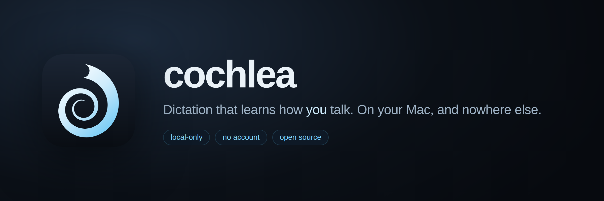

<div align="center">



**Dictation that learns how _you_ talk. On your Mac, and nowhere else.**

[Install](#install) · [Why](#why-this-exists) · [How it works](#how-it-works) · [Privacy](#privacy-concretely) · [Roadmap](#roadmap) · [Contributing](#contributing)

[](https://github.com/lexian24/cochlea/actions/workflows/ci.yml)
[](LICENSE)
[](#try-what-exists)
[](macos/README.md)

</div>

---

> ### ⚠️ Early. It dictates; it does not yet learn.
>
> **You can dictate with this.** Press the shortcut, speak, and the words
> appear at your cursor — in TextEdit, a browser, VS Code — at 383–441 ms
> warm on an M2. The hotkey, the microphone, the voice detection, device
> switching mid-session and typing at the cursor have all been exercised by
> hand, and six defects that only a person could find were fixed doing it
> ([macos/TESTING.md](macos/TESTING.md)).
>
> **It collects; it does not train yet.** Import your own writing and the
> recogniser is biased towards it immediately — no training involved. Press
> the fix shortcut after a mistake and the correction is repaired in place and
> filed, with the revision filter deciding whether it was a mishearing or a
> change of mind. What is missing is the last step: nothing on this machine
> trains a model on those corrections. The evaluation harness that will gate
> that training is built and tested; the trainer is not.
>
> **Not shipped.** No signed build, so a release you did not compile yourself
> would be refused by Gatekeeper. Build it from source, or wait.

## Install

```sh
brew tap lexian24/cochlea https://github.com/lexian24/cochlea
brew install cochlea
```

That installs the `dictate` CLI — the adaptation engine, importers, evaluation
harness, and the ASR helper the app talks to. Speech recognition needs the
`asr` extra, which is Apple Silicon only:

```sh
pip install 'cochlea[asr]'      # mlx-whisper
dictate asr-check my.wav --model ~/.cochlea/models/whisper-small
```

The menu bar app is not packaged yet: it needs signing and notarization (F22)
before `brew install --cask` is honest.

<details>
<summary>Other ways</summary>

```sh
# one-shot, no tap
brew install --formula https://raw.githubusercontent.com/lexian24/cochlea/main/Formula/cochlea.rb

# from source
git clone https://github.com/lexian24/cochlea && cd cochlea
pip install -e ".[dev,zh,acoustic]"
```

`brew install --cask cochlea` will install the menu bar app once there is one.
[`Casks/cochlea.rb`](Casks/cochlea.rb) records what that needs. See
[docs/RELEASING.md](docs/RELEASING.md).

</details>

## Why this exists

Off-the-shelf dictation is trained on everyone, so it is mediocre for anyone in
particular. It mangles your colleagues' names, your project's jargon, the
libraries you use daily, and — if you speak more than one language — most of
what you actually say.

The usual fix is to send your voice to a server that learns from millions of
people. cochlea does the opposite: it learns from one person, on that person's
machine, from corrections they explicitly make.

## How it works

Three adaptation layers, each cheaper and faster than the one below it:

| Layer | Learns from | Updates | Needs audio? |
|-------|-------------|---------|--------------|
| **Lexicon + biasing** | imported text, corrections | instantly | no |
| **Post-correction LM** | `(what ASR heard, what you meant)` pairs | nightly | no |
| **Acoustic adapter** | your voice | monthly, opt-in | yes |

The top two layers need **only text**. If you never let cochlea keep audio, you
still get most of the benefit — a supported configuration, not a degraded one.

```
audio → VAD → ASR (frozen) → contextual biasing → post-correction LM → your cursor
                                       ↓
                        fix-last hotkey / review queue
                                       ↓
                             attribution filter
                                       ↓
                              correction store  ← the durable asset
```

Corrections are captured **only when you explicitly make them** — a fix-last
hotkey or a review queue. cochlea does not watch your text fields. Reading
arbitrary app windows through the Accessibility API would be fragile and would
contradict the whole point.

## Privacy, concretely

- Nothing leaves your machine. There is no server to send it to.
- **Audio retention is off by default.** When enabled, cochlea stores
  log-mel spectrograms, not listenable audio; raw audio needs a separate opt-in.
- Stored features are AES-GCM encrypted, capped by both age and hours, and
  excluded from backup.
- Importers read **only your own** messages and commits, and filter before
  anything touches disk — not after.
- No permission is requested until you invoke the feature that needs it.
- `dictate purge` deletes everything, including the key.

The [invariants](docs/SPEC.md#6-invariants) list what the code may not do
regardless of what any test says. Two are enforced by CI.

## Try what exists

```sh
git clone https://github.com/lexian24/cochlea && cd cochlea
pip install -e ".[dev,zh,acoustic]"
pytest -q                      # 217 tests
```

Seed a lexicon from your own writing — the first step of the journey, and it
works today. Import proposes; nothing is written until you say so:

```console
$ dictate import text ~/chat-export.txt --author "Your Name"
imported 412 samples from text:~/chat-export.txt
  3 terms, 2 phrases
    + term   kubectl                      x27
    + term   nginx                        x19
    + phrase eval gate                    x14
    + phrase kubectl apply                x11
  orthography variant (F6): 'la' x14 vs 'lah' x9
    -- run `dictate lexicon canonicalize la lah` to pick one

Nothing was written. Re-run with --commit to keep this.
```

A chat export is a conversation, and half of it belongs to someone else, so
`--author` is not optional: with two speakers and no author, the import
refuses rather than guessing. `dictate import gitlog . --author you@example.com`
does the same from your commit history, filtered by git itself.

Then the recogniser is biased towards it — phrases in context, not just words:

```console
$ dictate asr-check sample.wav --model ~/.cochlea/models/whisper-small
text               Deploy the service with kubectl and check the gink's logs.

$ dictate asr-check sample.wav --model ~/.cochlea/models/whisper-small --lexicon
lexicon            5 entries
biased terms hit   kubectl, nginx
text               Deploy the service with kubectl and check the nginx logs.
```

That costs about 10 ms. `dictate lexicon` shows what is in there, what it is
worth in logits, and how often each entry has actually won.

The evaluation harness works too — it gates every future training run, so it
had to exist first:

```sh
dictate holdout                  # reserve a share, permanently, from training
dictate eval                     # holdout metrics and the gate decision
dictate adapters                 # versions, and which one is promoted
dictate rollback --layer postcorr
dictate doctor                   # paste this into a bug report
```

## Repository layout

| Path | What it is | Verified? |
|---|---|---|
| `src/cochlea/` | Adaptation engine: store, attribution, phonetics, importers, lexicon, biasing, eval, training, retention, profiles | yes — 217 tests |
| `macos/` | M0 dictation app (Swift) | 66 Swift tests in CI; hand-tested through T1–T7 |
| `Formula/`, `Casks/` | Homebrew formula (works) and cask (template) | formula verified end to end |
| `Resources/logo/` | Brand marks, generated by `Tools/make_logo.py` | — |
| `docs/SPEC.md` | The engineering spec and handoff | — |
| `docs/DECISIONS.md` | Decision records, with the reasoning kept | — |
| `docs/STAGE2-IPHONE.md` | iPhone design: one-way sync, no mic, no model | designed, not built |

## Roadmap

| | Milestone | State |
|---|---|---|
| **M0** | Competitive dictation, zero learning | ASR, hotkey, mic and injector all verified by hand (T1–T7); streaming and latch activation unproven (T9–T10) |
| **M1** | Correction capture | fix-last panel and store wired end to end (D11); review queue still CLI-only |
| **M2** | Lexicon and biasing | **wired end to end** — import → lexicon.json → biased decode, phrases included (D10); no feedback loop until M1 |
| **M3** | Evaluation harness — gates all training | **built** |
| **M4** | Post-correction LM | replay buffer, resource gate, rebuild built; needs an MLX trainer |
| **M5** | Acoustic adapter (opt-in) | retention, encryption, quarantine, purge built |
| **M6** | Profiles and community adapters | profiles + formality built; registry not started |
| **S2** | [iPhone extension](docs/STAGE2-IPHONE.md) — fixes Apple's dictation with your lexicon | designed, not started |

M0 is the gate that matters: if plain dictation is not competitive with what
you already use, nothing downstream gets a chance. Criteria in
[the spec](docs/SPEC.md#5-milestones).

## Contributing

Read [docs/SPEC.md](docs/SPEC.md) first — it records the decisions, the failure
modes the design must survive, and the acceptance criteria for each milestone.
Most useful right now:

- **M0**, the macOS app. The largest gap, and it blocks everything. Start at
  [`macos/BUILDING.md`](macos/BUILDING.md).
- **A phonetic backend for your language.** Implement `distance(a, b) -> float`
  and register it — see [`src/cochlea/phonetics.py`](src/cochlea/phonetics.py).
  Unsupported languages fall back to edit distance, so this is additive.
- **An importer.** Implement `extract(source) -> Iterable[TextSample]`,
  filtering to the user's own content *inside* `extract`.

New code must not violate an [invariant](docs/SPEC.md#6-invariants), and
`pytest` must pass with and without the optional extras.

## Not built here

cochlea does not train a general speech model, does not improve with other
people's data, and will not make an unfamiliar accent work well out of the box.
It makes *your* dictation better on *your* machine. Homophones
("their"/"there") cannot be fixed by vocabulary at all — that is what the
post-correction layer is for.

## License

MIT — see [LICENSE](LICENSE). Model weights and corpora carry their own terms;
per [F23](docs/SPEC.md#f23--licensing-on-models-and-data) each shipped
artifact's licence is recorded in `LICENSES-MODELS.md` before anything is
distributed.

The logo is generated by [`Tools/make_logo.py`](Tools/make_logo.py) and is MIT
like the rest. If cochlea ever gets a userbase worth protecting, consider
splitting brand from code the way [Vorssaint](https://github.com/vorssaintapp/vorssaint-utils)
does with a `TRADEMARKS.md`.
